- [Livrables](#livrables)

- [Échéance](#%c3%89ch%c3%a9ance)

- [Quelques éléments à considérer](#quelques-%c3%a9l%c3%a9ments-%c3%a0-consid%c3%a9rer-pour-les-parties-2-et-3)

- [Travail à réaliser](#travail-%c3%a0-r%c3%a9aliser)

# Sécurité des réseaux sans fil

## Laboratoire 802.11 Sécurité WPA Entreprise

**Auteurs: Robin Müller, Stéphane Teixeira Carvalho**

### Objectif :

1.	Analyser les étapes d’une connexion WPA Entreprise avec une capture Wireshark
2.	__(optionnel)__ Implémenter une attaque WPE (Wireless Pwnage Edition) contre un réseau WPA Entreprise
1.  __(optionnel)__ Implémenter une attaque GTC Dowgrade contre un réseau WPA Entreprise


## Quelques éléments à considérer pour les parties 2 et 3 :

Les parties 2 et 3 sont optionnelles puisque vous ne disposez pas forcement du matériel nécessaire pour les réaliser.

En principe, il devrait être possible de démarrer vos machines en Kali natif (à partir d'une clé USB, avec une distro live par exemple) ou d'employer une autre version de Linux. Si vous n'avez pas une interface WiFi USB externe, __vous ne pouvez pas faire ces parties dans une VM Linux__.

Dans le cas où vous arriverais à tout faire pour démarrer un Linux natif, il existe toujours la possibilité que votre interface WiFi ne puisse pas être configurée en mode AP, ce qui à nouveau empêche le déroulement des parties 2 e 3.

Ces deux parties sont vraiment intéressantes et __je vous encourage à essayer de les faire__, si vous avez les ressources. Malheureusement je ne peux pas vous proposer un bonus si vous les faites, puisqu'il risque d'y avoir des personnes qui n'auront pas la possibilité de les réaliser pour les raisons déjà expliquées.

Si vous vous lancez dans ces deux parties, voici quelques informations qui peuvent vous aider :

- Solution à l’erreur éventuelle « ```Could not configure driver mode``` » :

```
nmcli radio wifi off
rfkill unblock wlan
```
-	Pour pouvoir capturer une authentification complète, il faut se déconnecter d’un réseau et attendre 1 minute (timeout pour que l’AP « oublie » le client)
-	Les échanges d’authentification entreprise peuvent être facilement trouvés utilisant le filtre d’affichage « ```eap``` » dans Wireshark


## Travail à réaliser

### 1. Analyse d’une authentification WPA Entreprise

Dans cette première partie, vous allez analyser [une connexion WPA Entreprise](files/auth.pcap) avec Wireshark et fournir des captures d’écran indiquant dans chaque capture les données demandées.

- Comparer [la capture](files/auth.pcap) au processus d’authentification donné en théorie (n’oubliez pas les captures d'écran pour illustrer vos comparaisons !). En particulier, identifier les étapes suivantes :  
Dans toute les captures ci-dessous les communications se feront entre l'authentificateur `Cisco_60:bf:50` et le supplicant `HuaweiTe_70:df:32`.
	- Requête et réponse d’authentification système ouvert
		-	Requête d'authentification du client
			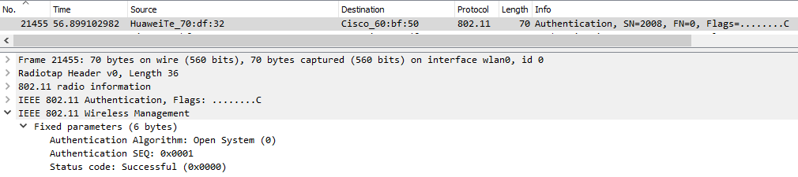
		-  Réponse d’authentification de l'AP
			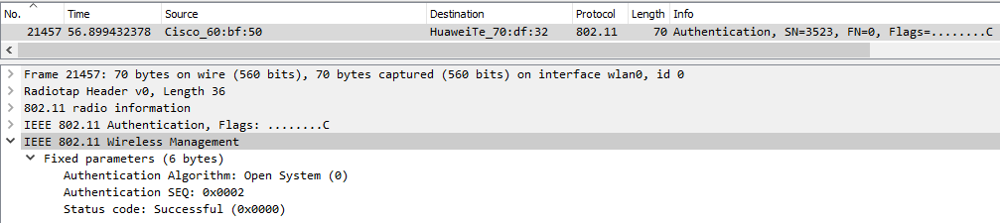
	- Requête et réponse d’association (ou reassociation)
		-	Requête d'association du client
			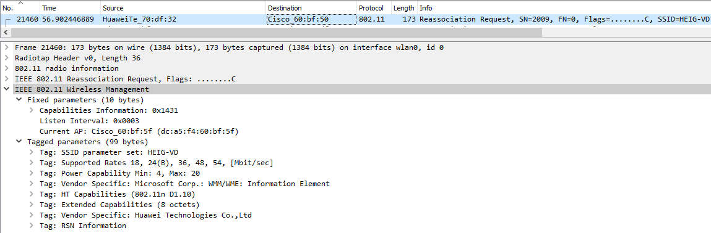
		-	Reponse d'association de l'AP
			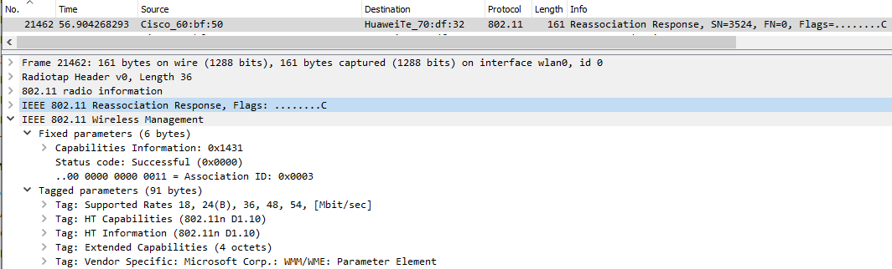
	- Négociation de la méthode d’authentification entreprise
		-	Demande d'utilisation de la méthode EAP-TLS de la part de l'AP
		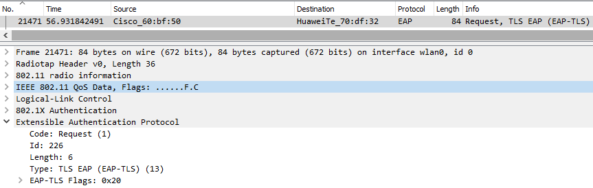
		- Mais, le client refuse cette méthode et indique en réponse celle qu'il désire qui est EAP-PEAP
		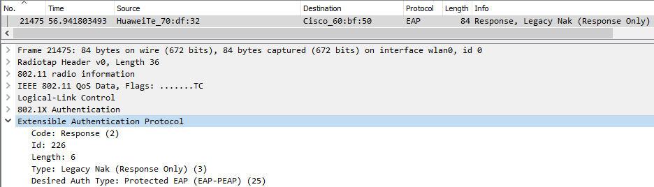
		- L'AP refait une requête pour choisir la méthode d'authentification mais cette fois-ci avec EAP-PEAP
		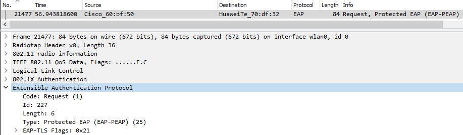
	- Phase d’initiation. Arrivez-vous à voir l’identité du client ?
		- Tout d'abord l'AP fait une demande au client de s'authentifier
		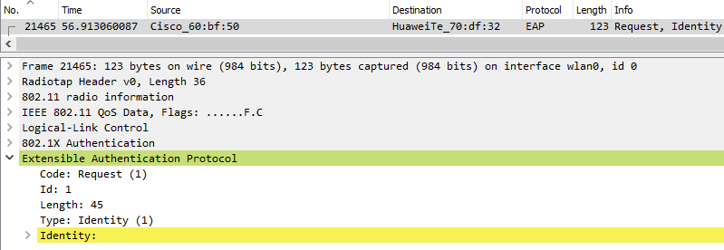
		- Le client répond aves son identifiant qui est einet\\joel.gonin.
		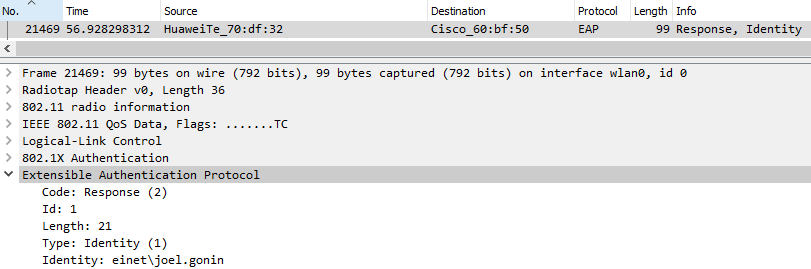
	- Phase hello :
		- Version TLS.
			- La version 1.2 est utilisée ici par le client
			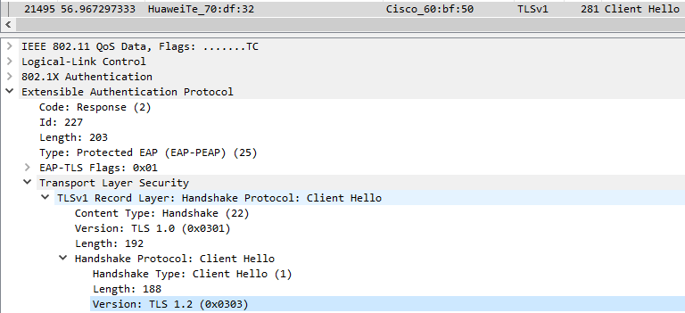
			- La version 1.0 est ensuite utilisée par le serveur
			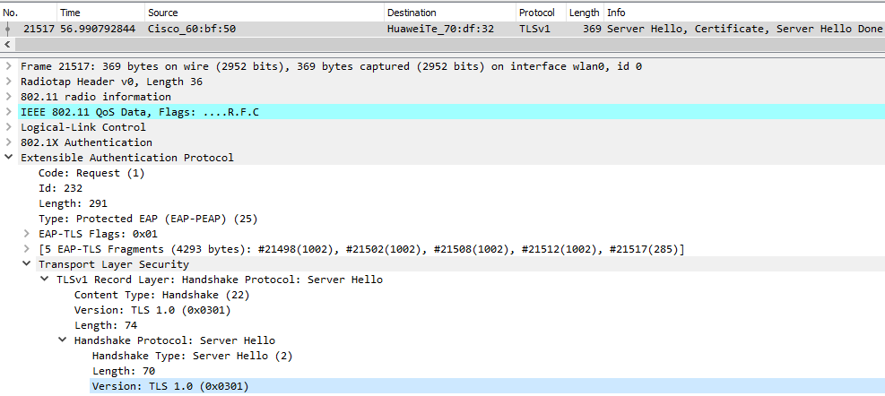
		- Suites cryptographiques et méthodes de compression proposées par le client et acceptées par l’AP
			- Suites cryptographiques proposée par le Client
			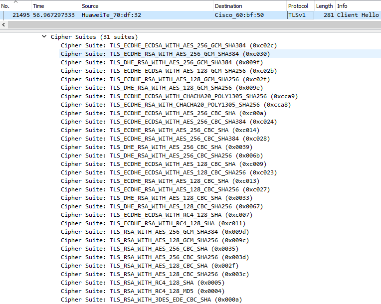
			- Le client ne va proposer aucune méthode de compression
			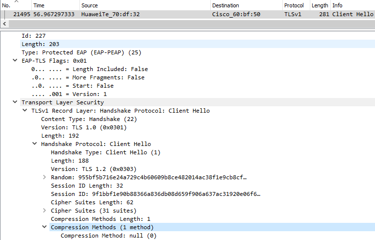
			- Le serveur en réponse ne va donc pas avoir de méthode de compression et va choisir la suite TLS\_RSA\_WITH\_AES\_256\_CDB\_SHA
			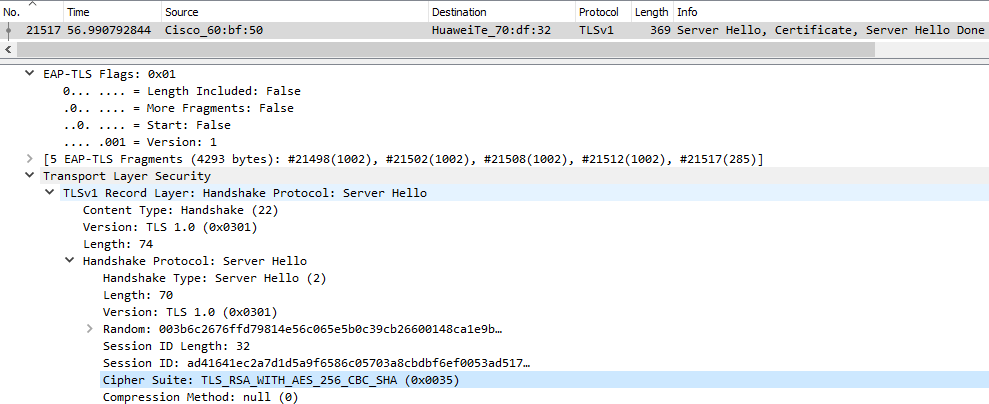
		- Nonces
			- Nonce du client  
			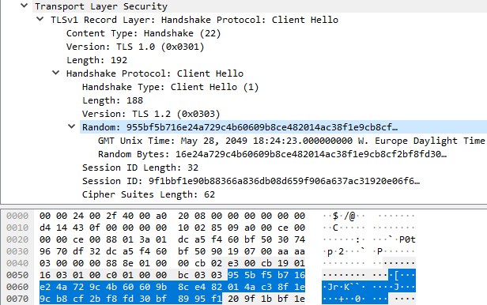
			- Nonce du serveur  
			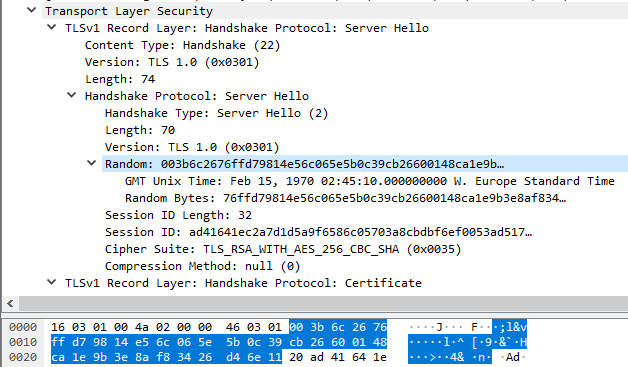
		- Session ID
			- Session ID du client  
			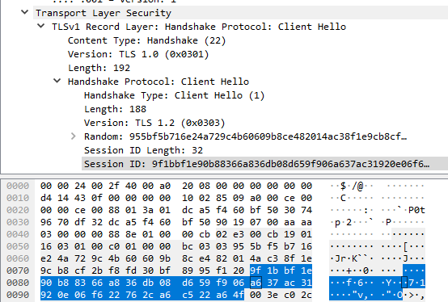
			- Session ID du Serveur  
			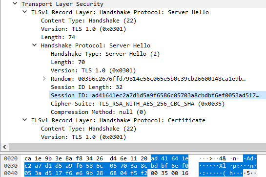
	- Phase de transmission de certificats
		- Echanges des certificats. Comme le protocole EAP-PEAP est utilisé ici seul le serveur envoie un certificat
		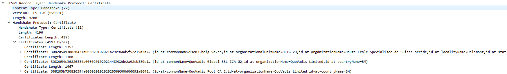
		- Change cipher spec
		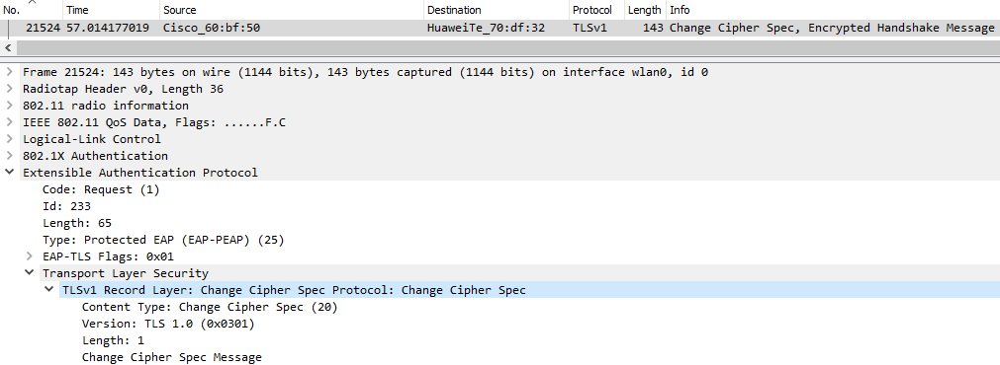
	- Authentification interne et transmission de la clé WPA (échange chiffré, vu comme « Application data »)
	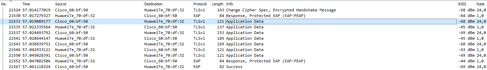
	- 4-way handshake
	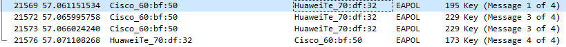

### Répondez aux questions suivantes :

> **_Question :_** Quelle ou quelles méthode(s) d’authentification est/sont proposé(s) au client ?
>
> **_Réponse :_**  Comme on peut le voir dans la partie 3 EAP-TLS et EAP-PEAP sont proposées.

---

> **_Question:_** Quelle méthode d’authentification est finalement utilisée ?
>
> **_Réponse:_** EAP-TLS a été refusée par le client et c'est donc EAP-PEAP qui est utilisée

---

> **_Question:_** Lors de l’échange de certificats entre le serveur d’authentification et le client :
>
> - a. Le serveur envoie-t-il un certificat au client ? Pourquoi oui ou non ?
>
> **_Réponse:_** Oui il envoie un certificat pour que le client puisse authentifier le serveur.
>
> - b. Le client envoie-t-il un certificat au serveur ? Pourquoi oui ou non ?
>
> **_Réponse:_** Non cela n'est pas prévu dans EAP-PEAP. De plus, comme nous pouvons le voir avec les captures ci-dessus seul le certificat serveur a été trouvé. Le client aurait dû envoyer un certificat si la méthode d'authentification EAP-TLS avait été utilisée. Le client est authentifié lors de la phase d'authentification interne grâce à MSCHAPv2 et donc aucun certificat n'a besoin d'être envoyé pour vérifier son authenticité.
>

---

### 2. (__Optionnel__) Attaque WPA Entreprise (hostapd)

Les réseaux utilisant une authentification WPA Entreprise sont considérés aujourd’hui comme étant très surs. En effet, puisque la Master Key utilisée pour la dérivation des clés WPA est générée de manière aléatoire dans le processus d’authentification, les attaques par dictionnaire ou brute-force utilisés sur WPA Personnel ne sont plus applicables.

Il existe pourtant d’autres moyens pour attaquer les réseaux Entreprise, se basant sur une mauvaise configuration d’un client WiFi. En effet, on peut proposer un « evil twin » à la victime pour l’attirer à se connecter à un faux réseau qui nous permette de capturer le processus d’authentification interne. Une attaque par brute-force peut être faite sur cette capture, beaucoup plus vulnérable d’être craquée qu’une clé WPA à 256 bits, car elle est effectuée sur le compte d’un utilisateur.

Pour faire fonctionner cette attaque, il est impératif que la victime soit configurée pour ignorer les problèmes de certificats ou que l’utilisateur accepte un nouveau certificat lors d’une connexion.

Pour implémenter l’attaque :

- Installer ```hostapd-wpe``` (il existe des versions modifiées qui peuvent peut-être faciliter la tâche... je ne les connais pas. Dans le doute, utiliser la version originale). Lire la documentation du site de l’outil ou d’autres ressources sur Internet pour comprendre son utilisation
- Modifier la configuration de ```hostapd-wpe``` pour proposer un réseau semblable au réseau de l’école ou le réseau de votre préférence, sachant que dans le cas d'une attaque réelle, il faudrait utiliser le vrai SSI du réseau de la cible
- Lancer une capture Wireshark
- Tenter une connexion au réseau (ne pas utiliser vos identifiants réels)
- Utiliser un outil de brute-force (```john```, par exemple) pour attaquer le hash capturé (utiliser un mot de passe assez simple pour minimiser le temps)

### Répondez aux questions suivantes :

> **_Question :_** Quelles modifications sont nécessaires dans la configuration de hostapd-wpe pour cette attaque ?
>
> **_Réponse :_** Nous avons simplement dû modifier le SSID et l'interface de la configuration par défaut de hostapd-wpe.
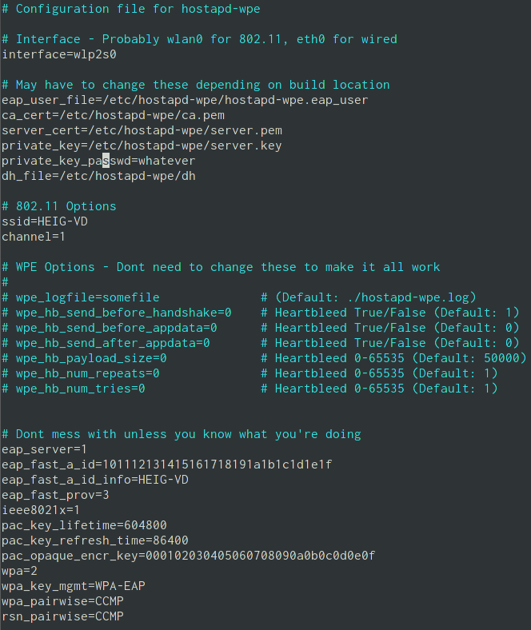

---

> **_Question:_** Quel type de hash doit-on indiquer à john pour craquer le handshake ?
>
> **_Réponse:_** Le type de hash *netntlm* a été indiqué à john pour craquer le hash.  
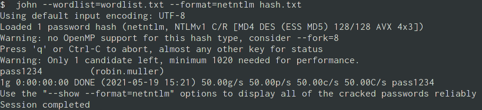

---

> **_Question:_** Quelles méthodes d’authentification sont supportées par hostapd-wpe ?
>
> **_Réponse:_** Les méthodes suivantes sont supportées: EAP-FAST/MSCHAPv2, PEAP/MSCHAPv2, EAP-TTLS/MSCHAPv2, EAP-TTLS/MSCHAP, EAP-TTLS/CHAP, EAP-TTLS/PAP.


### 3. (__Optionnel__) GTC Downgrade Attack avec [EAPHammer](https://github.com/s0lst1c3/eaphammer)

[EAPHammer](https://github.com/s0lst1c3/eaphammer) est un outil de nouvelle génération pour les attaques WPA Entreprise. Il peut en particulier faire une attaque de downgrade GTC, pour tenter de capturer les identifiants du client en clair, ce qui évite le besoin de l'attaque par dictionnaire.

- Installer ```EAPHammer```. Lire la documentation du site de l’outil ou d’autres ressources sur Internet pour comprendre son utilisation
- Modifier la configuration de ```EAPHammer``` pour proposer un réseau semblable au réseau de l’école ou le réseau de votre préférence. Le but est de réaliser une GTC Downgrade Attack.
- Lancer une capture Wireshark
- Tenter une connexion au réseau


### Répondez aux questions suivantes :

> **_Question :_** Expliquez en quelques mots l'attaque GTC Downgrade
>
> **_Réponse :_** Le but de cette attaque va être de forcer les clients à utiliser la méthode EAP-GTC. Cette méthode demande un one time password au client et envoie la réponse en clair sur le réseau. Le problème de ce protocole est que le client en recevant ce prompt peut penser que le mot de passe demandé est le mot de passe de son compte et donc s'il le rentre à ce moment là il passera en clair sur le réseau.

---

> **_Question:_** Quelles sont vos conclusions et réflexions par rapport à la méthode hostapd-wpe ?
>
> **_Réponse:_** hostapd-wpe semble être un outil très pratique pour effectuer des attaques sur WPA2 Entreprise. Un point négatif est que les attaques sur un réseau utilisant MSCHAPv2 ne sont pas très discrète, car le client n'arrive pas se connecter. Ceci est toutefois dû au protocole et non pas directement à hostapd-wpe.

## Livrables

Un fork du repo original . Puis, un Pull Request contenant :

-	Captures d’écran + commentaires
-	Réponses aux questions

## Échéance

Le 9 juin 2021 à 23h59
